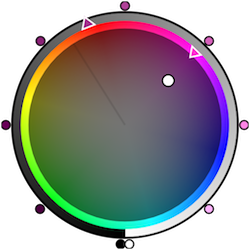
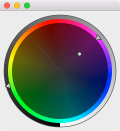
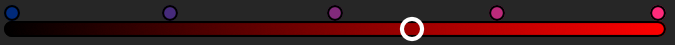
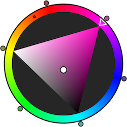
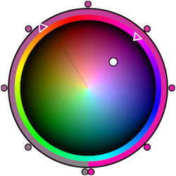
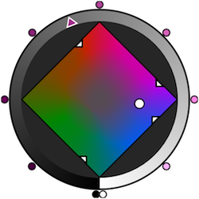
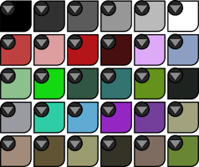
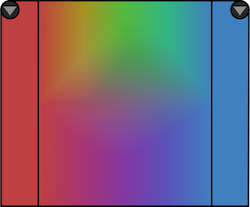
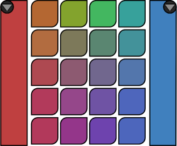
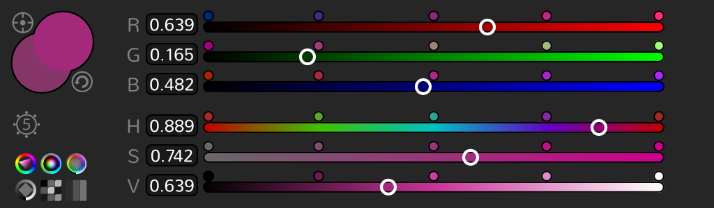

# NatronColorSelector

Color Selector Project for [Natron](https://github.com/MrKepzie/Natron)

To compile, make sure you have Qt installed (tested with Qt4).

```
git clone https://github.com/azerupi/NatronColorSelector.git
cd NatronColorSelector
qmake
make
```

# Progress

### HS/L Color Wheel (almost done)

  **Mock-up vs.  implementation**

  
  
### Color Slider

  **Mock-up vs.  implementation**

  

  No implementation yet
### SV/H Triangle Color Wheel

  **Mock-up vs.  implementation**

        No implementation yet
### HL/S Color Wheel

  **Mock-up vs.  implementation**

        No implementation yet
### TM/I Color Wheel

  **Mock-up vs.  implementation**

        No implementation yet
### Color Bank

  **Mock-up vs.  implementation**

        No implementation yet
### Color Ramp

  **Mock-up vs.  implementation**

        No implementation yet

        No implementation yet
### Color Selector
regroups all previous widgets in a meaningful way

        

  No implementation yet
